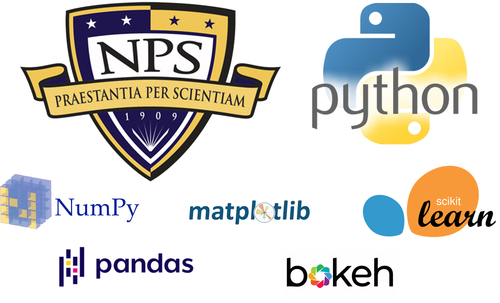

# NPS Python Primer

Matt Smith, NPS Opertaions Research Department, https://nps.edu/web/or.
Email: matthew.smith@nps.edu

# Description
This tutorial includes a series of lesson notebooks designed to cover fundamentals of Python, focusing on tools needed to perform data analysis workflows.

These lessons assume no prior knowledge of Python.  If brand new to Python, please see the Getting Started guide, and recommend starting with Lesson 1.

# Getting Started
To use this tutorial, recommend you download the files to your local machine, either by downloading the zip file of this Git repository, or using the `git clone` command if you are familiar.

Recommend using the [Anaconda Distrubtion](https://www.anaconda.com/download) on your local machine.  Anaconda includes the python language, as well as additional tools such as the Jupyter Notebook environment and the conda package and environment management tool.  Once Anaconda is installed, you can open the lesson notebooks.  See the `Getting_Started_Guide.docx` file for more details. 

# Lessons

### Lesson 1: Python and Jupyter Primer
- [Why Python](#Why-Python)
- [Jupyter Notebook Environment](#Jupyter-Notebook-Environment)
- [Basic Python Syntax](#Basic-Python-Syntax)
    - [Indentation](#Indentation)
    - [Comments](#Comments)
    - [Assigning Variables](#Assigning-Variables)
    - [Installing Packages](#Installing-Packages)
- [Data Types](#Data-Types)
    - Individual Items: [Numbers](#Numbers), [Strings](#Strings), [Booleans](#Booleans), [None Type](#None-Type), [Type-Casting](#Type-Casting)
    - Collection of Items: [Lists](#Lists), [Tuples](#Tuples), [Sets](#Sets), [Dicts](#Dicts), [Comprehensions](#Comprehensions)
- [String Matching](#String-Matching)
    - [Regex](#Regex)
- [Code Structures](#Code-Structures)
    - [If-else-elif](#If-else-elif)
    - [For Loops](#For-Loops)
    - [While Loops](#While-Loops)
    - [Try-Except](#Try-Except)
    - [Functions](#Functions)
    - [Classes](#Classes)
- [Working with Files](#Working-with-Files)

### Lesson 2: Numerical and Data Processing with Numpy and Pandas
- [Numpy](#Numpy)
    - Overview of Numpy for numerical computing, including array creation, manipulation, and mathematical operations.
- [Pandas Data Structures: DataFrame and Series](#Pandas-Data-Structures:-DataFrame-and-Series)
    - [Pandas Overview](#Pandas-Overview)
    - [DataFrame and Series Objects](#DataFrame-and-Series-Objects)
    - [Working with Data by Index and Columns](#Working-with-Data-by-Index-and-Column)
    - [Removing Data](#Removing-Data)
    - [Multi-Level Indexing](#Multi-Level-Indexing)
    - [Common Series Methods](#Common-Series-Methods)
    - [Filtering and Sorting Data](#Filtering-and-Sorting-Data)
- [Getting Data](#Getting-Data)
    - [From Files](#From-Files)
    - [From User Generated Data](#From-User-Generated-Data)
    - [Webscraping](#Webscraping)
    - [Writing and Saving Data](#Writing-and-Saving-Data)
- [Cleaning Data](#Cleaning-Data)
    - [Handling Nulls](#Handling-Nulls)
    - [Using Where Functions](#Using-Where-Functions)
- [Data Wrangling and Manipulation](#Data-Wrangling-and-Manipulation)
    - [Applying Functions and Transformations](#Applying-Functions-and-Transformations)
    - [Joining/Merging Data Sets](#Joining/Merging-Data-Sets)
    - [Aggregating Data: Groupby and Pivot Tables](#Aggregating-Data:-Groupby-and-Pivot-Tables)
- [Handling Dates and Times](#Handling-Dates-and-Times)

### Lesson 3: Data Visualization
- [Matplotlib](#Matplotlib)
  - [Quick Matplotlib Orientation](#Quick-Matplotlib-Orientation)
  - [Figures, Axes, and Subplots](#Figures,-Axes,-and-Subplots)
  - [Common Plot Types](#Common-Plot-Types)
  - [Labeling Plots](#Labeling-Plots)
- [Plotting with Pandas](#Plotting-with-Pandas)
  - [Pandas Plotting Overview](#Plotting-with-Pandas)
- [Seaborn](#Seaborn)
- [Interactive Graphics with Bokeh](#Interactive-Graphics-with-Bokeh)
- [Making GIFs](#Making-GIFs)
